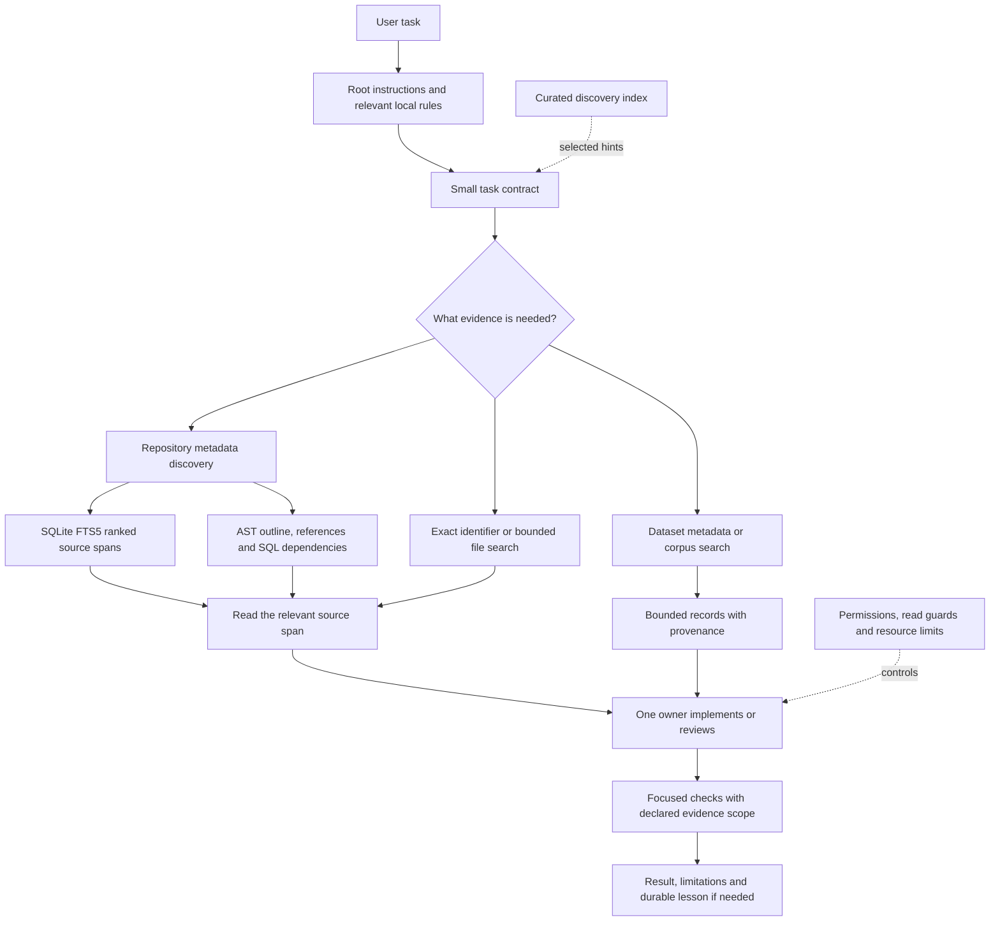

# A practical context harness: techniques to borrow and adapt

Prepared 6 September 2026. Companion inventory: [context-harness.yaml](context-harness.yaml).

This guide explains how a real, evolving Python and data-product repository gives coding agents useful context, tools, boundaries and verification. It is intended for another developer to select the pieces that fit their own environment. The transferable design is more important than the particular editor, model or directory names.

The setup combines short repository instructions, targeted retrieval, curated lessons, bounded tools, explicit agent ownership and deterministic checks. BM25 and FTS5 are useful parts of that arrangement, but search only helps if the indexed sources are appropriate, the results preserve provenance and the agent knows which follow-up operation to use.

**This is a reference guide, not a giant startup prompt or an installation bundle.** Read the overview, choose a small initial set, and implement those pieces against your own acceptance tests. The YAML is a structured extract with stable technique IDs, applicability, caveats, adoption checks and source pointers. It is not valid configuration for a particular agent client.

## 1. What was inspected and what is portable

The evidence comes from the public repository's current working-tree source, relevant existing tests and selected official documentation. The source HEAD was `522dd59b41140430d15563747f5ff22161685418`, but the checkout already contained substantial staged and unstaged work. The YAML therefore includes hashes of referenced source files; the commit alone does not identify the inspected implementation.

This export contains explanations and small generic examples. It contains no credentials, private product source, personal memory contents, raw conversation transcripts, private service addresses or corpus extracts. Repository-relative paths identify where a mechanism originated; your friend does not need those files to understand the design. Obtaining or copying implementation files is a separate step, subject to their repository's license and access arrangements.

Four labels are used throughout:

| Label | Meaning |
| --- | --- |
| Implemented | The mechanism exists in inspected source. Activation and effectiveness are separate questions. |
| Optional | A mechanism is available, but its usefulness or activation depends on the workflow. |
| Historical | A dated measurement or decision; it was not reproduced as a new benchmark for this export. |
| Proposed | An adaptation suggested here; it is not claimed to be installed in the source setup. |

Useful foundations for almost any stack are a short instruction router, scoped searches, clear task packets, one owner for edits, a canonical verification command and honest evidence reporting. SQLite chunk search becomes attractive when navigation is repeatedly expensive. DuckDB corpus search, data-grain rules, Streamlit firewalls and native-library thread caps are stack-specific additions. Cross-session handoff machinery is appropriate only when there is an actual coordination problem to solve.

## 2. The architecture in one picture



The search layers answer different questions. Metadata answers which object is relevant. Chunk retrieval finds likely lines. Structural tools explain relationships. Dataset descriptions establish what a row means. Corpus search finds relevant source records. The agent then returns to the authoritative source or contract before making a consequential claim.

These are complementary routes. A SQL dependency graph cannot establish that an upstream source is complete. A BM25 hit cannot establish legal or factual truth. An empty keyword search cannot establish that a function or record does not exist.

## 3. A small starting setup

A friend can start with ordinary files and a test runner. No embedding service, orchestration platform or elaborate memory system is required for the first phase.

```text
your-project/
  AGENTS.md                 short routing and invariant guide
  docs/
    INDEX.md                compact document map when needed
  src/
    subsystem/
      AGENTS.md             only the rules specific to this subsystem
  tools/
    dev.py                  or the equivalent task runner in your stack
    discoveries.jsonl       optional small lesson index
  memory/
    known-trap.md           curated evidence, not a transcript dump
  tests/
  .rgignore
  .cache/                   derived indexes; excluded from version control
```

This tree is an example, not a claim that these exact directory names are required. A JavaScript project might use package scripts, a Rust project might use Cargo aliases and a JVM project might use Gradle tasks. Preserve the invariant that documented commands and executable checks agree.

An illustrative root instruction file:

```markdown
# Agent guide

## Start

1. Inspect Git status and preserve unrelated work.
2. Read the nearest instructions for the subsystem being changed.
3. Search filenames or metadata before opening large bodies.

## Routing

| Work | Start here | Relevant check |
| --- | --- | --- |
| API behavior | src/api/ | API contract tests |
| Query behavior | src/queries/ | Query contract tests |
| Presentation | src/ui/ | Rendering and accessibility checks |

## Invariants

- Keep source provenance and distinguish missing data from zero.
- Keep business transformations in their owning layer.
- One writer owns a checkout at a time.
- A review request is read-only until a repair is separately assigned.

## Verification

Use the project's canonical focused command after a change.
Report the command, observed result and any relevant unrun checks.
```

For Codex, instruction discovery is ordered by global and project scopes, with files nearer the working directory taking precedence within the documented discovery process. Check actual behavior from the directory where the agent starts, including configured fallback names. Other clients can differ. [Official instruction-discovery documentation](https://learn.chatgpt.com/docs/agent-configuration/agents-md).

## 4. Retrieval: BM25, FTS5, DuckDB and structural lookup

### 4.1 The names refer to different things

| Term | Role in this setup | What it does not establish |
| --- | --- | --- |
| BM25 | Lexical relevance ranking used by multiple implementations | Truth, confidence or completeness |
| SQLite FTS5 | Local full-text index for repository content chunks | A vector database or an application data warehouse |
| DuckDB FTS | Full-text extension used for application text corpora | The same cache or API as SQLite FTS5 |
| Metadata scoring | Small heuristic ranking over names and descriptions | BM25 scoring or semantic understanding |
| AST and reference tools | Source structure, definitions, imports and references | Complete knowledge of runtime dispatch |
| SQL dependency tools | Parsed view and column relationships with labeled fallbacks | Proof that the underlying data is correct |
| Exact lookup | IDs, keys, explicit paths and complete filtered feeds | Topic relevance ranking |

BM25 uses term occurrence, term rarity and document length to rank lexical matches. Repeating a common word indefinitely should not make a document infinitely useful, and a long body should not win merely because it contains more words. The repository also has a small pure-Python BM25 implementation in its tool-catalog evaluation code, making those calculations inspectable without a service dependency.

The score scale is implementation-specific. SQLite's built-in `bm25()` is ordered ascending, with numerically smaller values ranked better. The local DuckDB corpus query orders its score descending. Do not merge raw scores from these engines as though they have the same scale. Repository chunk results expose the ranked order and snippet rather than a numeric score. [SQLite FTS5 reference](https://www.sqlite.org/fts5.html#the_bm25_function).

### 4.2 The actual repository-search path

`search_project` builds small metadata entries from dataset fact cards, the documentation index, SQL view descriptions and Python module or symbol information. Its current metadata scoring gives a token match in a name more weight than a match in descriptive text, and adds a whole-query name bonus. It sorts those records deterministically by score and tie-break fields.

The tool can also attach separately ranked `content_spans` from the SQLite chunk index. These are two result collections, not one blended retrieval score. A caller should inspect whether a metadata result, a source span or both answer the question.

The content search currently extracts ASCII letters, digits and underscores from the query. It quotes terms for MATCH syntax, tries AND first, then tries OR only if the AND query produced no rows. That fallback improves recall for a partially matching query, but can return evidence covering only some terms. It is useful to expose the chosen mode in a new implementation; the local response does not currently report that mode.

The chunk search API clamps a direct limit to 1–25. The `search_project` wrapper requests six content spans. The SQL snippet helper requests a small excerpt, and the final `why` string is capped at 200 characters. A span includes kind, a scope header, path, inclusive line range and a short explanation. The intended next step is a bounded source read, not treating the excerpt as the whole function.

The ASCII query preprocessor deserves attention in a multilingual repository. SQLite's tokenizer capability and the application's query preparation are separate layers. Even if the engine handles Unicode, an ASCII-only preprocessor may discard important query characters. Test accented identifiers, non-Latin text, punctuation and mixed alphanumeric references with the exact deployed preprocessing chain.

### 4.3 Why structural chunks matter

The source index preserves top-level gaps, decorators, signatures and scope headers. Large classes split into structural and method chunks. Markdown splits on headings. Long bodies are broken into line windows so a marker near the end can still be retrieved.

The current body target is 4,000 characters, and large classes split above 150 lines. These are engineering choices for this repository, not universal optima. A single physical line can exceed the target; reporting an honest source span takes priority over pretending a truncated body covers that line completely.

Good chunk acceptance tests are concrete: a query finds a decorator, a nested method, a module constant between definitions, a heading near the end of a long document and a unique marker after the first window of a large function. Assert both the match and the truthfulness of the returned line span. A test that merely checks that some chunks exist misses the important failure modes.

### 4.4 A runnable, dependency-light FTS5 demonstration

This small example illustrates the chunk table and AND-to-OR strategy. It uses invented source records in memory. It deliberately adds a `match_mode` result that is useful for adaptation but is not currently exposed by the repository tool. It is a teaching example, not a complete indexer: it has no filesystem admission policy, incremental refresh, language-specific preprocessing or concurrency management.

```python
import re
import sqlite3

con = sqlite3.connect(":memory:")
con.execute("""
    CREATE VIRTUAL TABLE chunks USING fts5(
        header, body, path UNINDEXED, span UNINDEXED, kind UNINDEXED
    )
""")
con.executemany(
    "INSERT INTO chunks VALUES (?, ?, ?, ?, ?)",
    [
        ("writer.save", "Atomic parquet writes enforce a row floor.",
         "src/writer.py", "10-18", "code-chunk"),
        ("search.help", "Search tokens locate relevant source spans.",
         "docs/search.md", "4-9", "doc-section"),
    ],
)

def search(query, limit=5):
    # ASCII preparation matches this project's current query policy.
    terms = re.findall(r"[a-zA-Z0-9_]+", query)
    if not terms:
        return {"match_mode": "empty", "hits": []}
    for mode in ("AND", "OR"):
        expression = f" {mode} ".join(f'"{term}"' for term in terms)
        rows = con.execute(
            "SELECT path, span, kind, bm25(chunks) FROM chunks "
            "WHERE chunks MATCH ? ORDER BY bm25(chunks) LIMIT ?",
            (expression, max(1, min(limit, 25))),
        ).fetchall()
        if rows:
            return {"match_mode": mode, "hits": rows}
    return {"match_mode": "none", "hits": []}

assert search("atomic row floor")["hits"][0][0] == "src/writer.py"
assert search("atomic absentterm")["match_mode"] == "OR"
assert search("!!!")["hits"] == []
print("FTS5 example passed")
con.close()
```

Use SQL parameter binding for values and still control the MATCH expression grammar. These are separate concerns. An FTS query parser can reject arbitrary punctuation even when the SQL value was safely bound. In a user-facing interface, decide whether users are writing plain text or an advanced query language and test that contract.

### 4.5 Index refresh is part of retrieval correctness

The SQLite source cache tracks `mtime_ns:size`, removes deleted source rows, replaces changed chunks and persists parse or decoding errors. It also tracks import edges and uses an extraction/schema version to invalidate old output. Its refresh commits through SQLite; it is not a temporary-database-and-rename publication system. The server wrapper normally throttles content refresh to once per 120 seconds per process, so edits are not instantly reflected. The metadata index is also cached in process; do not assume every search rebuilds every layer.

Cheap fingerprints have limits. If a tool rewrites a file with equal size and preserves its timestamp, the fingerprint can miss the change. A stronger adaptation can hash content or bind refresh to an explicit source manifest. The YAML export uses file hashes to identify the inspected source; that does not mean the search cache itself uses those hashes.

Consider both freshness and visibility. A perfectly current index of the wrong allowed files is still wrong for the task. Git-based admission deliberately excludes untracked source from ordinary public discovery. This is protective, but it means a newly created module may not be visible until it is tracked, and a broken Git-root lookup can leave the source inventory empty.

The current code also suppresses some low-level SQLite search errors into an empty span list. Refresh errors may be surfaced, and metadata can still work, but not every unavailable state is distinguishable from no match. An adaptation should prefer an explicit envelope such as the following proposed contract:

```yaml
status: ok                 # proposed values: ok, partial, unavailable
results: []
coverage:
  scope: git_tracked_public_sources
  source_revision: example-revision
  truncated: false
retrieval:
  engine: sqlite_fts5
  match_mode: and
diagnostics:
  index_errors: []
  refreshed_at: example-timestamp
```

This is a proposed interface improvement. The current implementation has its own fields and does not return this exact envelope.

### 4.6 DuckDB corpus search is a separate system

The public text-search implementation materializes speeches, questions and council minutes in `.cache/text_fts.duckdb`. It uses the FTS extension, Porter stemming, lowercase normalization and English stopwords. Its explicit ignore expression preserves ASCII digits, so the local implementation already addresses a common numeric-token trap. It still needs exact lookup for identifiers whose punctuation or formatting is meaningful.

Corpus freshness is weaker than content hashing: it compares row count and maximum date, once per process and corpus until its check cache resets. Same-count corrections with an unchanged maximum date can escape that check. When adapting this design, use a dataset build ID or a content/version manifest if corrections to existing rows matter.

Rebuilding drops existing FTS dependencies, replaces the materialized table, builds the new index and records metadata only after success. It does not restore the old cache atomically on a failed build. Structured error reporting is present; a previous-good-cache publication strategy would be a separate improvement.

The corpus search limits results to 50. Concise output uses small routing fields and 140-character text excerpts; detailed output retains provenance fields and increases the excerpt to 280 characters. Detailed does not mean the full document text. Follow the source URL or retrieve the relevant record when the task needs the original evidence.

Provision and test the extension for the pinned DuckDB build. The current upstream FTS repository describes options that may be newer than the installed release, including version-dependent update behavior. Do not infer that those features exist in this project's current implementation. [DuckDB FTS upstream reference](https://github.com/duckdb/duckdb-fts).

### 4.7 When to add embeddings or other search techniques

This source chunk path uses lexical retrieval; it does not require embeddings. A useful sequence is to measure real misses, improve source metadata and vocabulary, fix chunk coverage and identifier handling, then consider a semantic route if paraphrase misses remain important.

If you add semantic retrieval, evaluate it against the same known targets and privacy boundary. Keep lexical exact-name search available. Test whether the additional index, embedding model, update schedule and reranking latency buy better evidence retrieval for your actual tasks.

A literal multi-pattern matcher answers a different question: which curated strings occur in a body? It can be useful for bounded candidate tagging. It should not casually replace ranked search or an ordered classifier whose first matching rule carries meaning. That distinction is an architectural recommendation, not a claim that another matching library has been adopted here.

## 5. MCP, skills and context budgets

Tool metadata is part of the user interface for an agent. Names and descriptions should explain when to call a tool, what the result covers, what it omits and how to obtain citation fields. Small defaults should still contain enough information to select the next operation.

The repository explicitly reserves always-loaded status for six navigation tools. The static checker allows no unexpected member of that set and separately enforces catalog size budgets. It validates the source catalog; it does not prove that every client honors the deferral metadata. The metadata key in use is client-specific.

| Budget or threshold | Current source value | Interpretation |
| --- | --- | --- |
| Reusable prompt/role words | 600 | Applies to the checker's discovered prompt and role files |
| SessionStart context | 1,600 characters | Tiny session status, not a full project synopsis |
| Discovery rows | At most 2 | Relevant, deduplicated lesson hints |
| Discovery text per row | 320 characters | Additional labels can add output beyond this text field |
| Source chunk body | 4,000-character target | Not a model-token count or strict single-line cap |
| Direct chunk-search results | 1–25 | Wrapper currently asks for 6 spans |
| Always-loaded catalog descriptions | 6,000 characters | Separate from argument schemas and runtime output |
| Per-tool description | 2,000 characters | Avoids giant tool instructions |
| Full catalog descriptions | 55,000 characters | Does not include every other context source |
| Full catalog tool ceiling | 80 | A project ratchet, not an MCP protocol limit |
| Closeout trigger | 500 turns | Current source; older documentation says 20 |

Do not sum these values into an exact session token budget. They measure different units and different surfaces. A model tokenizer, a client schema envelope and repeated tool results can add substantial overhead beyond the visible descriptions.

Skills use a similar disclosure principle: initial metadata helps select a skill, then the chosen `SKILL.md` provides its full workflow. A precise description is more useful than installing every available skill. Keep examples and references behind the entry point when they are only needed for specialized cases. [Official skills documentation](https://learn.chatgpt.com/docs/build-skills).

For MCP portability, separate the server implementation from client configuration. STDIO and HTTP have different startup, authentication and transport concerns. Use environment variables or the platform's credential mechanism for secrets, and verify the actual client starts the server. A valid TOML or JSON file does not prove a successful handshake. [Official MCP configuration documentation](https://learn.chatgpt.com/docs/extend/mcp?surface=cli).

The inspected `.codex/config.toml` registers SessionStart, spawn validation and Stop closeout hooks. A broader compatibility matrix exists in `.codex/hooks.json`, including a discovery hint using a Claude-specific environment variable. The guide does not claim that the current Codex session executes every entry in that matrix. Check the client-supported registration format, reviewed hook definitions, trust state and a real invocation. In this inspected non-worktree environment, the registered Codex launch commands depend on the failing Git-root lookup and cannot reach their hook scripts. Registration is present; invocation and enforcement are unavailable through those commands here, and have not been established in a normal trusted client.

## 6. Memory that survives a session without becoming a dump

The useful unit of project memory is a small reusable lesson with evidence. Mandatory rules belong in instructions or an executable check. A discovery index provides a short trigger-keyed reminder. A memory card holds the context, exceptions, date and reproduction detail. Session handoff state holds what is currently unfinished.

Those records have different lifetimes. The fact that a test process is still running belongs in a handoff. The fact that an extractor must publish atomically belongs in a durable rule. A dated benchmark belongs in a report with its source revision. A preference specific to one person does not automatically belong in a public repository.

An illustrative discovery record, based on the local index's field vocabulary:

```json
{"id":"atomic-artifact-publication","domain":"engineering","trigger":["writer","partial file","publication"],"discovery":"Write and validate a sibling temporary artifact before replacing the canonical output.","memory":"atomic-artifact-publication","cost_band":"med"}
```

A companion card can contain:

```markdown
# Atomic artifact publication

Verified: YYYY-MM-DD, against the named source revision and test.

Lesson: a direct write can destroy the previous artifact before completion.
Scope: jobs that replace a shared derived output.
Evidence: source path, focused failure fixture and passing command.
Limit: atomic replacement does not prove semantic completeness.
Recheck when: writer implementation, storage backend or publication flow changes.
```

Do not fabricate a cost band or claim that every card is verified simply because it has a template. Fill the record from observed evidence. If a card has been corrected or superseded, preserve that fact and point to the replacement.

The local closeout system permits `promoted`, `already-captured` and `no-durable-delta`. The last is a complete result. A harness that forces every session to invent a new lesson will accumulate low-value rules and contradictory advice.

Memory age and link checks are useful maintenance signals. They are not a truth detector. Some old facts remain stable; some recent facts are wrong. Prioritize verification using change likelihood and consequence, and label any unrefreshed historical claim accordingly.

## 7. Delegation, ownership and handoff

The captain owns the objective and integrates the answer. Scouts map bounded source questions. Reviewers inspect correctness and evidence. Workers implement named changes in named files. The source project's policy requires fresh context for these roles and a complete five-part brief.

An example handoff packet for a read-only scout:

```markdown
## Objective
Find the current query-to-index route and its documented failure behavior.

## Scope
Read src/search/, its local instructions and tests/search/ only.

## Invariants
Read-only. Do not inspect credentials, corpus bodies or private directories.
Distinguish implementation from comments and historical measurements.

## Acceptance
Identify entry point, query normalization, ranking, limits and refresh behavior.
Return precise source paths and unresolved uncertainty.

## Result contract
Return concise evidence grouped by mechanism, caveat and source location.
Do not repair, commit, push or post externally.
```

Parallelism helps when tracks are independent. Two read-only agents can inspect different subsystems while the captain prepares integration. Two agents editing the same checkout create a much harder ownership problem. The local policy allows one writer per checkout; independent parallel implementation requires proper worktree ownership and integration, with stricter constraints around nested private repositories.

Cross-session sidecars add snapshot-bound packets and receipts. They distinguish accepted-but-unconsumed work from delivery. The target owns integration, verification and closure. If queueing or receipt writing is ambiguous, the claim remains in a recovery state until the target is inspected and the outcome resolved.

These receipts are useful precisely because they avoid inferring success from an intermediate event. They are not a managed async-agent service. The current public tools do not expose the historical `job-status` command mentioned in older personal notes, and the sidecar helper explicitly does not maintain a general active-task ledger.

For a long task that remains one coupled line of reasoning, native compaction plus a durable handoff is usually a simpler fit. Record the goal, constraints, authoritative paths, completed work, exact test evidence and next unresolved step. Do not create an extra agent solely because context usage is high.

## 8. Verification that is both fast and honest

The repository has one command surface for linting, formatting, source conventions, contracts, tests and harness checks. It wraps existing checks rather than creating a second policy system for agents.

The project's normal focused command is:

```powershell
uv run --locked --group dev --extra pipeline --extra api --extra mcp python tools/dev.py verify
```

Inspect the selected checks without running or bootstrapping them:

```powershell
uv run --locked --group dev --extra pipeline --extra api --extra mcp python tools/dev.py verify --plan
```

A broader local check and the lightweight prompt contract check are separate commands:

```powershell
uv run --locked --group dev --extra pipeline --extra api --extra mcp python tools/dev.py check
python tools/dev.py agent-context
```

These commands are examples from this Python repository. Adapt the command surface to your dependency manager and packages. Do not install unrelated pipeline or MCP extras merely to copy the shape of the command.

The changed-file verifier considers committed, staged, unstaged and untracked changes. It selects checks using an inspectable policy and labels whether they require local pipeline output or external sources. Its success receipt binds source content, Git state, interpreter/runtime information, policy and selected checks. Failed runs do not create a green receipt.

This is a useful cache design beyond testing: cache a result only against the inputs that determine it. If the policy changes, the old pass should expire. If a dependency profile was repaired, rerun rather than treating the old environment's pass as current. The repository explicitly requires `verify --no-cache` after a repair or bootstrap.

Behavioral changes use a test-first seam: identify the observable contract, record a focused failing case, make the smallest change and record the green command. Use UI or transport fakes where appropriate, but keep real data-contract coverage beneath them. A final passing checkout does not establish the chronology of red and green; the work record must do that.

Documentation exports have a different acceptance seam. Their checks should validate parsing, cross-references, example execution, source pointers, privacy and fidelity to the inspected implementation. They do not need a fabricated failing production test.

## 9. Evaluating the harness itself

Evaluate a harness with the same skepticism as an application feature. Define the task distribution and the failure you want to improve. Measure correctness, latency, tool usage, context usage and infrastructure errors separately.

There are at least four different evaluation layers:

| Layer | Example question | Typical limitation |
| --- | --- | --- |
| Deterministic control | Does the spawn validator reject a missing invariant section? | Does not prove the agent chooses good tasks |
| Retrieval quality | Does a known document appear in the top five? | Distinctive phrase probes can be easier than real user language |
| Agent behavior | Does the agent make a correct change with fewer calls? | Small public tasks can be memorized or unrepresentative |
| Operational integration | Does the fresh client start, authenticate and use the server? | One successful machine does not prove every deployment |

The repository has a BM25 surrogate benchmark for the tool catalog. It reads the actual `tools/list` descriptions and tests whether the intended tool appears among the top candidates. This evaluates the catalog under that surrogate. It does not expose or reproduce a proprietary client's tool-selection implementation.

Application retrieval tests are separate. They can call the same functions directly or use MCP transport. A direct call avoids serialization, subprocess startup and handshake behavior. Report the transport rather than calling both routes equivalent end-to-end tests.

The agent benchmark uses paired cleanroom variants, repeated tasks and manifests. It excludes obvious answer-key paths and Git history from the agent working directory. A cleanroom copy still does not stop a client with arbitrary host-file access from leaving that directory. Strict private holdouts need a container, VM or equivalent mount and permission boundary that keeps answers accessible only to the evaluator.

### Historical measurement worth preserving

The checked-in 2026-08-05 public smoke report compared five tasks with three repeats per arm. The figures below are the report's observations, not a new measurement of the current checkout.

| Measure | Harness off in cleanroom | Harness on | Reported change |
| --- | --- | --- | --- |
| Mean score | 0.978 | 0.978 | No measured gain |
| Perfect attempts | 14/15 | 14/15 | No measured gain |
| Tool calls | 60 | 43 | 28.3% fewer |
| Raw input tokens | 1,980,172 | 1,536,547 | 22.4% fewer |
| Uncached input tokens | 489,228 | 364,067 | 25.6% fewer |
| Total elapsed seconds | 517.477 | 855.356 | 65.3% longer |

The useful conclusion is that structural enforcement and reduced context cost can coexist with worse latency and unchanged accuracy. The report also records retrieval timeouts and a small authored-query evaluation. A friend should repeat the relevant comparison on their own tasks before expecting these effects.

Source: `doc/AGENT_HARNESS_MEASUREMENT_2026_08_05.md`, especially its verdict, run contract, results and limitations. The YAML records this as historical evidence and includes the source file's identity.

## 10. Known limitations in the inspected setup

The source is a useful collection of techniques, but this export is not a claim that the whole setup is currently healthy.

| Finding | Consequence for an adaptation |
| --- | --- |
| Ambient Git root discovery reports that the checkout is not a work tree | Source admission fails closed; no indexed code is not proof that no code exists |
| Six current code-index tests failed under that Git condition | Do not describe the current repository-navigation path as fully verified |
| Some low-level FTS errors become an empty span list | Prefer explicit unavailable or partial states in a new interface |
| SQLite freshness uses timestamp and size | Use stronger identity when preserved timestamps or same-size edits matter |
| DuckDB freshness uses count and maximum date | Same-count corrections can be missed |
| DuckDB cache rebuilding is not previous-good atomic publication | Design and test failure recovery if search availability matters |
| Source query preparation is ASCII-oriented | Evaluate multilingual queries through the whole pipeline |
| Section-map checking proves presence only | Refresh and verify ranges after substantive edits |
| Older documentation says closeout at 20 turns | Current source says 500; inspect implementation before copying thresholds |
| Discovery-hook registration differs between current TOML and compatibility JSON | Verify the actual client registration and trust rather than assuming every hook runs |
| Always-load metadata is client-specific | Measure the effective catalog delivered to the model |
| Cleanroom copies do not isolate the host | Use real permission boundaries for secret held-out answers |
| Legacy telemetry and memory-maintenance scripts include local assumptions | Parameterize roots and retention before reuse |
| No current general job-status command was found | Avoid copying historical commands as installed capability |

The public repository MCP search request and the Pi Firstmate advisory request were attempted during preparation but did not return before cancellation. Firstmate was asked to consider both Public Signal and SpecPlan. Its integration produced no findings used in this guide. Local source and test evidence remained the basis of the export.

## 11. Choosing what to adopt

Start with the failure you repeatedly observe. If the agent reads entire modules before finding the target function, use metadata, section maps or chunk retrieval. If it repeats a known mistake, add a concise discovery card and a deterministic check when the failure is mechanically detectable. If it chooses the wrong tool, improve names and descriptions and run catalog recall probes. If it finds the right tool but the wrong records, examine corpus coverage, query processing and ranking.

If test runs consume most iteration time, add an inspectable changed-file plan and effective-input receipts. If agents race on edits, fix ownership before increasing concurrency. If tools start slowly or sessions exhaust memory, measure import cost and process count before adding more services.

A practical adoption sequence is:

1. Establish a small root instruction router, bounded reads, a task contract, one writer and canonical verification.
2. Add a generated document map and SQLite source retrieval when repeated navigation cost justifies them.
3. Introduce curated lessons, relevant hints and explicit closeout when repetition shows a need.
4. Add independent scouts or reviewers for clearly separable tasks, and cross-session receipts only for real handoffs.
5. Apply data-stack controls and evaluate harness variants against representative tasks before widening the setup.

There is no need to import the source project's exact model names, package extras, commercial domain rules or plugin collection. Carry over the principles and measurable acceptance seams. Keep any additional complexity accountable to a concrete improvement.

## 12. Technique inventory

The following catalog is generated from the companion YAML. Each technique has a stable ID so a friend can select items or annotate adoption decisions without copying the entire document into an agent prompt.

### T01. Layered repository instructions

Category: instructions. Status: implemented. Adoption priority: foundation.

**Mechanism.** Put project-wide invariants and routing in root AGENTS.md; put subsystem-specific rules in nested AGENTS.md files.

**Current implementation.** The root routes API, UI, SQL, extraction, MCP and private-product work to the relevant paths. CLAUDE.md is a configured compatibility fallback, not the shared canonical entry point.

**Why it is useful.** A new agent can find the applicable rules without inheriting a large personal prompt or reading unrelated subsystems.

**When to use it.** Any repository used by more than one session, developer or coding-agent client.

**How to adapt it.** Write a short root router with setup, ownership, forbidden failure modes and verification commands; add local guidance only where rules differ.

**Caveats.**

- Instruction discovery and merge precedence are client-specific; verify what a fresh session actually receives.
- Prose is guidance, not filesystem permissions or an executable safety boundary.

**Adoption check.** From root and a nested directory, confirm the agent identifies the correct instructions and commands.

**Source pointers.** `AGENTS.md`, `mcp_server/AGENTS.md`, `.codex/config.toml`.

### T02. Five-part task and result contract

Category: instructions. Status: implemented. Adoption priority: foundation.

**Mechanism.** Use Objective, Scope, Invariants, Acceptance and Result contract for reusable task packets.

**Current implementation.** Shared prompts and project roles use bounded packets; reviews ask for an evidence-bearing verdict with severity, source location, consequence and required action.

**Why it is useful.** Makes the task assessable and limits wandering, unowned edits and vague claims of success.

**When to use it.** Delegating work, starting a substantial change or requesting independent review.

**How to adapt it.** Name allowed files and the observable acceptance seam; require commands and observed results, including NOT RUN limitations.

**Caveats.**

- A well-formed packet does not prove the implementation or acceptance test is correct.
- Keep the brief proportional to the task; routine edits do not need a project-length plan.

**Adoption check.** A fresh reviewer can determine scope and pass criteria from the packet alone.

**Source pointers.** `AGENTS.md`, `doc/AGENT_HARNESS.md`, `tools/check_agent_context.py`.

### T03. Progressive disclosure of skills and prompts

Category: instructions. Status: implemented. Adoption priority: foundation.

**Mechanism.** Show small capability descriptions first and load the full instructions only for a relevant task.

**Current implementation.** Project skills live under .agents/skills; reusable prompt and role files are checked against a 600-word ceiling. That ceiling does not apply to all documentation or every AGENTS.md file.

**Why it is useful.** Preserves attention for the actual task while making specialist workflows available on demand.

**When to use it.** A setup has multiple skills, task templates or specialist subsystems.

**How to adapt it.** Give each skill a precise trigger and non-trigger, a short entry point and separate supporting references.

**Caveats.**

- Installed skill catalogs themselves consume context; a large collection can become a second prompt dump.
- Use current client documentation for skill discovery rather than assuming every editor uses the same directories.

**Adoption check.** A representative task selects the relevant skill without opening unrelated skill bodies.

**Source pointers.** `.agents/skills/tdd/SKILL.md`, `tools/check_agent_context.py`.

### T04. Generated documentation map with currency metadata

Category: instructions. Status: implemented. Adoption priority: scaling.

**Mechanism.** Generate a compact index from document metadata, including domain, status, updated date and read-when guidance.

**Current implementation.** tools/build_doc_index.py reads root doc Markdown plus selected stale or superseded archive files. It estimates tokens from UTF-8 bytes divided by four and checks generated-index drift.

**Why it is useful.** Helps an agent choose a small relevant document and avoid treating obsolete plans as current implementation.

**When to use it.** Documentation has grown large enough that filenames alone are insufficient.

**How to adapt it.** Define a small front-matter schema and generate the map; require explicit LIVE, STALE or SUPERSEDED state and a replacement link when relevant.

**Caveats.**

- A declared LIVE status is an editorial assertion, not a runtime test.
- Byte-based token estimates are rough and language-dependent; this generator does not recursively index every documentation subdirectory.

**Adoption check.** Change a tracked document heading or routing field and confirm the index check notices drift.

**Source pointers.** `tools/build_doc_index.py`, `doc/INDEX.md`.

### T05. Section maps and bounded source reads

Category: instructions. Status: implemented. Adoption priority: foundation.

**Mechanism.** Put a generated map at the top of very large modules, then read only the relevant line span.

**Current implementation.** tools/section_map.py targets Python files at approximately 1500 lines and accounts for the map shifting subsequent line numbers.

**Why it is useful.** Avoids spending most of a context window just locating a function in a large file.

**When to use it.** A repository contains large legacy modules or generated-looking files that cannot immediately be split.

**How to adapt it.** Generate navigation maps or use AST outlines; retain enough surrounding context to understand imports, shared state and callers.

**Caveats.**

- The current --check verifies map presence, not that every recorded range is current.
- Regenerate maps after substantial edits; a stale range is a navigation hint, not evidence.

**Adoption check.** Locate a known late-file function without reading the whole module and verify the recorded span against source.

**Source pointers.** `tools/section_map.py`, `AGENTS.md`.

### T06. Scoped ripgrep and deliberate exclusions

Category: retrieval. Status: implemented. Adoption priority: foundation.

**Mechanism.** Discover filenames before opening content, scope text searches to relevant trees and hide bulky generated artifacts from ordinary searches.

**Current implementation.** .rgignore excludes common corpus, database, image, PDF, log and output paths while allowing selected metadata. AGENTS.md recommends rg --files and scoped rg -n.

**Why it is useful.** Reduces noise, runtime and accidental context flooding without needing a search service.

**When to use it.** Every repository; especially data-heavy monorepos.

**How to adapt it.** Maintain exclusions for the actual tree and override only a known path when the task needs it.

**Caveats.**

- An excluded or untracked file can exist even if search finds nothing.
- Ignore files are not access-control mechanisms.

**Adoption check.** Default discovery omits bulky test corpora but an explicit bounded lookup of a known artifact remains possible.

**Source pointers.** `.rgignore`, `AGENTS.md`.

### T07. Metadata-first repository discovery

Category: retrieval. Status: implemented. Adoption priority: scaling.

**Mechanism.** Answer where a concept lives using small metadata records before searching full bodies.

**Current implementation.** search_project combines dataset fact-card metadata, documentation index records, SQL view descriptions and Python module or symbol metadata, with optional content spans.

**Why it is useful.** Routes broad questions to the appropriate evidence surface instead of making the agent infer data contracts from incidental code.

**When to use it.** A repository has multiple kinds of authoritative information: source, schemas, datasets and design records.

**How to adapt it.** Return kind, name, path and why; provide a next-step tool for each kind, such as outline, dependency lookup or dataset description.

**Caveats.**

- Metadata ranking is a lexical heuristic; it is distinct from the content FTS5 BM25 ranking.
- Missing metadata or indexing exclusions can make relevant material invisible.
- The metadata index is cached in process; it is not rebuilt from the filesystem for every search.

**Adoption check.** Known dataset-shape questions route to fact cards and known implementation questions route to source spans.

**Source pointers.** `mcp_server/server.py`, `mcp_server/code_index.py`, `mcp_server/fts_index.py`.

### T08. SQLite FTS5 with BM25 for repository chunks

Category: retrieval. Status: implemented. Adoption priority: scaling.

**Mechanism.** Store source chunks in a local FTS5 virtual table and rank matching chunks using SQLite's bm25 function.

**Current implementation.** The chunks table indexes header and body; path, span and kind are UNINDEXED provenance fields. The derived cache lives at .cache/project_fts.sqlite. The schema uses SQLite's default tokenizer rather than an explicitly configured Porter tokenizer.

**Why it is useful.** Provides useful lexical retrieval without an embedding service, vector database or separate search daemon.

**When to use it.** Questions share identifiers, domain vocabulary or phrases with source and documentation.

**How to adapt it.** Check the actual Python SQLite build supports FTS5, store exact spans, bind query parameters and return a small ranked result set.

**Caveats.**

- SQLite bm25 sorts best matches by numerically smaller values; do not copy a descending-score convention from another engine.
- Lexical retrieval can miss synonyms, alternate terminology and language-specific morphology.
- FTS5 is a capability of the linked SQLite build; it is not guaranteed by merely having Python installed.
- The current query preprocessor accepts only ASCII letters, digits and underscores; some SQLite search errors are suppressed into an empty result list.

**Adoption check.** A tiny real fixture returns the intended chunk first and a punctuation-heavy query does not produce SQL or MATCH-parser failures.

**Source pointers.** `mcp_server/fts_index.py`, `test/mcp_server/test_fts_index.py`.

### T09. Structure-aware chunks with truthful spans

Category: retrieval. Status: implemented. Adoption priority: scaling.

**Mechanism.** Chunk by syntax and headings, then window oversized bodies while preserving scope information and exact source locations.

**Current implementation.** Python chunks retain decorators, top-level gaps, signatures and class context. Classes over 150 lines split structurally and by methods. Markdown uses level-one to level-three headings. BODY_CAP is a 4000-character target, not a model-token ceiling.

**Why it is useful.** Retrieved evidence stays understandable and late sections of a long function are not silently lost.

**When to use it.** File-level search produces large follow-up reads or naive fixed windows disconnect methods from their context.

**How to adapt it.** Preserve path, inclusive line span, symbol or heading and body; include enough scope in the searchable header for disambiguation.

**Caveats.**

- A single oversized physical line can exceed a target window cap; never truncate it while claiming the full line is indexed.
- Parsing can fail on unsupported syntax or bad encodings; return the error and a bounded fallback where implemented.

**Adoption check.** Search for a unique marker in the tail of a long method and verify that the returned snippet and span actually cover it.

**Source pointers.** `mcp_server/fts_index.py`, `test/mcp_server/test_fts_index.py`.

### T10. Incremental index refresh and versioned cache invalidation

Category: retrieval. Status: implemented. Adoption priority: scaling.

**Mechanism.** Re-index changed files, remove deleted sources, invalidate old extraction schemas and report refresh failures.

**Current implementation.** Repository FTS fingerprints use nanosecond mtime plus file size; schema version 4 governs stored chunks and import edges. A files table, meta table and errors table support refresh accounting.

**Why it is useful.** Keeps retrieved locations tied to the current tree without rebuilding every unchanged source on every request.

**When to use it.** Agents frequently edit files while a persistent search process is running.

**How to adapt it.** Refresh before using cached spans and surface read, parse and scan errors; bump the extraction version when chunking semantics change.

**Caveats.**

- mtime plus size is a cheap change detector, not a cryptographic content identity.
- Same-size content rewritten with preserved timestamps can evade that detector; use hashes for stricter reproducibility.
- A search cache is disposable and must not become the only copy of evidence.
- SQLite refresh commits transactionally; it does not publish a temporary database with an atomic file rename.
- The server wrapper throttles content refresh to at most once per 120 seconds per process when memory scope is unchanged; recent edits can temporarily leave cached spans stale.

**Adoption check.** Cover add, modify, delete, invalid syntax, encoding failure and schema migration with small fixture repositories.

**Source pointers.** `mcp_server/fts_index.py`, `mcp_server/code_index.py`, `test/mcp_server/test_fts_index.py`.

### T11. Explicit search admission and memory namespaces

Category: retrieval. Status: implemented. Adoption priority: foundation.

**Mechanism.** Decide which sources may enter an index before ranking, and separate repository knowledge from personal assistant memory.

**Current implementation.** Public source scans admit Git-tracked allowed files and exclude dot, private, generated and sandbox trees. Public memory uses kind=memory; personal memory needs explicit kind=external_memory and returns a separate memory://external/ namespace.

**Why it is useful.** Prevents a public navigation endpoint from casually mixing private source or workstation notes into ordinary results.

**When to use it.** Public and private repositories coexist, or local engineering memory contains sensitive material.

**How to adapt it.** Centralize scan policy, canonicalize paths, test traversal and link behavior and fail visibly if the approved file inventory cannot be obtained.

**Caveats.**

- Search admission is one layer; filesystem and tool authorization still matter.
- An explicit external-memory request does not make old notes current or suitable for redistribution.
- Git-root detection currently fails in the inspected ambient checkout and produces an empty source inventory; this can look like no match rather than a clearly labeled unavailable state.

**Adoption check.** Public searches exclude private and untracked fixture files; an unavailable source inventory does not silently widen the scan.

**Source pointers.** `mcp_server/code_index.py`, `mcp_server/fts_index.py`, `mcp_server/server.py`, `test/mcp_server/test_code_index.py`.

### T12. Structural navigation beyond text matching

Category: retrieval. Status: implemented. Adoption priority: scaling.

**Mechanism.** Use Python ASTs, semantic references and SQL parsing to answer structural questions that keyword search cannot establish.

**Current implementation.** code_outline returns definitions and spans; py_deps exposes imports; py_refs supports targeted references; view_deps and column_deps report SQL dependencies and provenance with parse-mode limitations.

**Why it is useful.** Helps assess the effect of a rename, a dependency change or a new SQL view before editing callers blindly.

**When to use it.** Refactoring, API changes, SQL registration changes and data-lineage questions.

**How to adapt it.** Keep output bounded and distinguish exact parsed edges from fallback or unresolved analysis.

**Caveats.**

- Dynamic imports, generated SQL, monkey-patching and runtime dispatch can escape static analysis.
- No reference found is not proof that a public API is unused.

**Adoption check.** Small fixtures cover alias imports, nested scopes, CTEs and view-order risks; unknown cases remain visibly unknown.

**Source pointers.** `mcp_server/code_index.py`, `mcp_server/py_refs.py`, `mcp_server/sql_index.py`, `test/mcp_server/test_py_refs.py`, `test/mcp_server/test_sql_index.py`.

### T13. Dataset fact cards and grain-aware descriptions

Category: retrieval. Status: implemented. Adoption priority: specialist.

**Mechanism.** Expose dataset purpose, row grain, columns, provenance and currency through a compact metadata interface.

**Current implementation.** describe_dataset and related MCP metadata routes use fact cards rather than making the agent load whole parquet files. Repository rules distinguish monetary grains and prohibit invalid totals.

**Why it is useful.** Makes the meaning of a row and a measure explicit before the agent joins or sums data.

**When to use it.** Data products, analytics, ETL and repositories containing large generated datasets.

**How to adapt it.** Define grain, key fields, unit, source, refresh date, coverage and forbidden aggregations for each critical dataset.

**Caveats.**

- A fact card can become stale; validate it against the pipeline contract and current artifact when accuracy requires it.
- Similar column names do not establish compatible grains or valid entity joins.

**Adoption check.** A shape query returns bounded metadata, and a contract test rejects a deliberately invalid aggregation or join.

**Source pointers.** `mcp_server/server.py`, `services/data_contracts.py`, `doc/DATA_GRAINS.md`, `AGENTS.md`.

### T14. DuckDB full-text indexes for data corpora

Category: retrieval. Status: implemented. Adoption priority: specialist.

**Mechanism.** Build a derived full-text database for an application corpus and use match_bm25 to retrieve relevant records with their provenance.

**Current implementation.** mcp_server/text_fts.py materializes speech, question and council-minutes tables in .cache/text_fts.duckdb with Porter stemming, lowercase normalization, English stopwords and explicit provenance columns. The configured ignore expression preserves ASCII letters and digits.

**Why it is useful.** Supports topic relevance across a whole corpus while keeping the analytical data stack and source-record links available.

**When to use it.** The application already uses DuckDB and needs relevance search across substantial text collections.

**How to adapt it.** Treat the FTS extension and derived database as separately versioned dependencies; define rebuild behavior and provision the extension before an offline deployment.

**Caveats.**

- This is separate from the repository's SQLite FTS5 cache; the two APIs and score conventions are not interchangeable.
- This implementation preserves digits; punctuation, case and stemming still make lexical matching different from exact identifier lookup.
- Do not assume the newest upstream extension options are supported by the locally pinned build.
- Freshness uses row count plus maximum date, checked once per process and corpus; same-count edits with an unchanged maximum date can be missed.
- Rebuild drops FTS dependencies and replaces the table before indexing succeeds; it does not preserve the previous-good cache atomically.
- Search errors are structured; there is no SQLite fallback for these DuckDB corpus tools.

**Adoption check.** Verify known-item recall, digit tokens, refresh detection, failure reporting, detailed provenance and actual server transport separately.

**Source pointers.** `mcp_server/text_fts.py`, `test/mcp_server/test_text_fts.py`, `tools/evals/app_retrieval_recall.py`.

### T15. Route exact identifiers, relevance and completeness separately

Category: retrieval. Status: implemented. Adoption priority: foundation.

**Mechanism.** Match the retrieval method to the question: exact lookup for IDs, ranked search for topics, complete filtered feeds or counts for exhaustive questions.

**Current implementation.** MCP speech and question search tools distinguish topic relevance from member-specific complete feeds; evaluation probes explicitly test numeric identifier limitations.

**Why it is useful.** Prevents top-k search results from being mistaken for every relevant record or a verified absence.

**When to use it.** A system mixes entity lookup, natural-language search and analytical totals.

**How to adapt it.** Expose separate query modes and return truncation, filters and coverage information; preserve exact identifiers outside a prose tokenizer.

**Caveats.**

- Top-k relevance is not an exhaustive result set or a completeness guarantee.
- BM25 scores are not probabilities, confidence grades or proof that a claim is true.

**Adoption check.** A query for every record uses a complete feed, and a query for a numeric reference still works if the prose tokenizer discards digits.

**Source pointers.** `mcp_server/server.py`, `mcp_server/text_fts.py`, `tools/evals/app_retrieval_recall.py`.

### T16. Small always-loaded MCP navigation surface

Category: tools. Status: implemented. Adoption priority: scaling.

**Mechanism.** Keep a small navigation toolset immediately visible and make the wider domain catalog eligible for client-side deferral.

**Current implementation.** The six named navigation tools are search_project, code_outline, py_deps, py_refs, view_deps and column_deps. A static checker enforces names, read-only annotations and description budgets.

**Why it is useful.** Makes discovery cheap without forcing every domain schema into every session.

**When to use it.** An MCP server has many domain tools and the client supports deferred discovery.

**How to adapt it.** Start with a few tools covering find, outline, references and metadata; measure whether the client actually defers the rest.

**Caveats.**

- anthropic/alwaysLoad is client-specific metadata, not a universal MCP loading guarantee.
- The current ceilings are 80 tools, 55000 catalog-description characters, 8 always-loaded tools, 6000 always-loaded-description characters and 2000 characters per tool; the exact allowed navigation set contains six.

**Adoption check.** The catalog check rejects an unintended always-loaded domain tool and an oversized description.

**Source pointers.** `mcp_server/AGENTS.md`, `tools/check_mcp_catalog.py`, `mcp_server/server.py`.

### T17. Tool descriptions as a tested interface

Category: tools. Status: implemented. Adoption priority: foundation.

**Mechanism.** Treat names, argument schemas, descriptions, result shapes and failure behavior as the agent-facing API.

**Current implementation.** MCP guidance requires bounded structured results and concise defaults with explicit detailed modes for provenance-heavy responses; shared query logic is reused behind tools.

**Why it is useful.** Improves tool selection and prevents a model from needing to guess undocumented response semantics.

**When to use it.** Building MCP tools, internal APIs or callable agent utilities.

**How to adapt it.** Explain when to use the tool, what the result covers, what absence means and how to obtain citation fields.

**Caveats.**

- readOnlyHint communicates intent; it does not enforce read-only OS permissions.
- Result limits should preserve errors and provenance, rather than blindly truncating all output.

**Adoption check.** Exercise success, no-match, unavailable, invalid input and detailed-provenance responses through the real public seam.

**Source pointers.** `mcp_server/AGENTS.md`, `mcp_server/server.py`, `test/mcp_server/test_mcp_server_smoke.py`.

### T18. Cheap startup and real transport probes

Category: tools. Status: implemented. Adoption priority: scaling.

**Mechanism.** Defer heavy imports and verify that a tool server can actually initialize over its intended transport.

**Current implementation.** MCP guidance requires lazy data-stack imports and shared capped connections. Session status checks can perform a real stdio initialization probe, beyond parsing configuration and compiling source. Hook behavior is conditional on successful client invocation.

**Why it is useful.** Distinguishes a valid-looking configuration from a reachable server and avoids repeated process startup exhausting memory.

**When to use it.** Local tool servers start once per agent session or rely on native data libraries.

**How to adapt it.** Keep stdout protocol-clean, put diagnostics on stderr, bound startup and probe timeouts and verify environment/path expansion with the actual launcher.

**Caveats.**

- A successful initialize response does not prove every tool or dataset works.
- Direct Python calls do not exercise subprocess startup or MCP serialization. In this snapshot, registered Codex hook launch commands depend on the failing Git-root lookup, so those commands do not establish active enforcement.

**Adoption check.** Test config parsing, module import, handshake and one representative tool invocation as separately reported layers.

**Source pointers.** `mcp_server/server.py`, `mcp_server/resource_policy.py`, `tools/hooks/session_context.py`, `services/runtime_env.py`.

### T19. Durable lessons in portable repository files

Category: memory. Status: implemented. Adoption priority: foundation.

**Mechanism.** Store mandatory rules in AGENTS.md, small trigger-keyed lessons in a discovery index and supporting evidence in curated repository memory cards.

**Current implementation.** tools/discoveries.py searches compact JSONL lessons and resolves public cards before private or workstation compatibility locations. memory/README.md defines promotion and currency expectations.

**Why it is useful.** Makes useful experience survive sessions and providers without requiring a transcript archive in every prompt.

**When to use it.** The same traps, commands or decisions repeatedly need to be rediscovered.

**How to adapt it.** Capture one lesson per card with a date, trigger vocabulary, evidence, caveats and a next verification step.

**Caveats.**

- Some historical detail cards remain workstation-only; a portable one-line index does not make their supporting files portable.
- Do not automatically promote raw transcripts or personal memory into shared project truth.

**Adoption check.** A new clone can find a selected mandatory lesson and its supporting evidence without the author's home directory.

**Source pointers.** `tools/discoveries.py`, `memory/README.md`, `AGENTS.md`.

### T20. Small, relevant, deduplicated memory hints

Category: memory. Status: implemented. Adoption priority: scaling.

**Mechanism.** Inject only a few short lessons whose trigger terms match the current request, with session deduplication and output caps.

**Current implementation.** discovery_hint.py selects at most two rows, caps discovery text at 320 characters per row and skips prompts below 20 characters. A broader compatibility hook matrix registers it; the inspected Codex TOML does not register UserPromptSubmit.

**Why it is useful.** Makes remembered lessons actionable without turning every prompt into a memory dump.

**When to use it.** Developers have curated lessons but agents routinely fail to consult the index.

**How to adapt it.** Use task vocabulary, avoid generic triggers and measure irrelevant-hint rates as well as useful recall.

**Caveats.**

- A keyword match is not proof that a lesson applies; inspect the underlying evidence when material.
- Hook payload names, trust and lifecycle differ across clients.
- A 1200-token discovery-hook cap mentioned in older documentation is not established by the inspected current registration; do not treat it as an active limit.

**Adoption check.** Relevant hints appear once, unrelated short prompts stay quiet and the output respects a measured cap.

**Source pointers.** `tools/hooks/discovery_hint.py`, `.codex/config.toml`, `memory/README.md`, `.codex/hooks.json`.

### T21. Memory currency and explicit closeout

Category: memory. Status: optional. Adoption priority: scaling.

**Mechanism.** Assess stale or corrected knowledge and record whether a substantive session produced a durable lesson.

**Current implementation.** memory_gc.py reports age, links, correction markers and orphans; archival is explicit. Closeout accepts promoted, already-captured or no-durable-delta with a meaningful note. Current turn threshold is 500 in both session_closeout.py and closeout_gate.py.

**Why it is useful.** Keeps the knowledge base useful while allowing a complete session to produce no new permanent rule.

**When to use it.** Long-running project memory has accumulated duplicates, outdated claims or repeatedly unrecorded fixes.

**How to adapt it.** Prefer reporting and human curation; separate handoff state from enduring rules and verify facts before reusing old measurements.

**Caveats.**

- Older interoperability documentation says 20 turns; the inspected current code says 500.
- Currency bands are prioritization heuristics, not proof that a card is true; the legacy memory tool contains workstation-specific assumptions.

**Adoption check.** Corrected and orphaned fixture cards are flagged; a meaningful no-durable-delta closeout is accepted without manufacturing a lesson.

**Source pointers.** `tools/memory_gc.py`, `tools/session_closeout.py`, `tools/hooks/closeout_gate.py`, `memory/README.md`.

### T22. Separate hard guards from advisory nudges

Category: tools. Status: implemented. Adoption priority: foundation.

**Mechanism.** Use deterministic blocking for concrete harmful operations and bounded, rate-limited advice for style or efficiency.

**Current implementation.** Read and memory-pressure guards coexist with advisory flood and routing hints. SessionStart context is bounded to 1600 characters and status failures must not break a session. Hook behavior is conditional on successful client invocation.

**Why it is useful.** Avoids both silent high-impact failures and a noisy harness that interrupts harmless work.

**When to use it.** Adding lifecycle hooks or agent policy checks.

**How to adapt it.** Define the exact blocked seam, supported payload shapes, failure policy and escape/repair procedure; test with each intended client.

**Caveats.**

- A guard implemented as a client hook only covers the tools and payloads the hook actually receives.
- Do not present a configured hook as active until its trust and invocation have been checked. In this snapshot, registered Codex hook launch commands depend on the failing Git-root lookup, so those commands do not establish active enforcement.

**Adoption check.** A real forbidden action is rejected with a useful reason, while ordinary bounded work stays quiet.

**Source pointers.** `tools/hooks/guard_data_reads.py`, `tools/hooks/guard_memory.py`, `tools/hooks/flood_warn.py`, `tools/hooks/session_context.py`.

### T23. Prevent data and output floods at the seam

Category: tools. Status: implemented. Adoption priority: foundation.

**Mechanism.** Block raw reads of heavy data and guide large source reads toward slices, metadata or bounded analytical queries.

**Current implementation.** guard_data_reads.py recognizes data paths and database suffixes; a 64000-byte threshold catches large unbounded source reads, with image exceptions. flood_warn.py issues a rate-limited advisory after roughly 8000 output characters.

**Why it is useful.** Prevents an accidental dump from consuming the useful context for an entire task.

**When to use it.** Data files, long logs, huge modules or broad shell output are common.

**How to adapt it.** Return counts, aggregates and bounded snippets; preserve an artifact on disk for detailed inspection instead of printing everything.

**Caveats.**

- Bytes and characters are rough text-budget proxies; image size in bytes is not a token estimate.
- A shell or another client may bypass a read-tool hook; combine good query interfaces with applicable permissions.

**Adoption check.** Heavy fixture data is refused, a bounded source span succeeds and a flood warning does not repeat on every call.

**Source pointers.** `tools/hooks/guard_data_reads.py`, `tools/hooks/flood_warn.py`, `.rgignore`.

### T24. Bounded agents with one integration owner

Category: coordination. Status: implemented. Adoption priority: scaling.

**Mechanism.** Keep one captain responsible for scope and integration; delegate independent read-only discovery or review, and tightly scope any writer.

**Current implementation.** Project policy defines scout, reviewer and worker roles, fresh five-part briefs, one writer per checkout and waiting for requested results before completion.

**Why it is useful.** Gains independent analysis without letting agents race on the same files or silently expand scope.

**When to use it.** There are genuinely independent research, implementation or verification tracks.

**How to adapt it.** Delegate a bounded question with exact paths and a result contract; keep coupled decisions and integration in the primary thread.

**Caveats.**

- More agents multiply startup context, memory use and coordination cost.
- A review request is read-only; fixing its findings is a distinct authorized write task.

**Adoption check.** Each agent can name its owned paths and role, and final integration accounts for every requested result and disagreement.

**Source pointers.** `AGENTS.md`, `tools/hooks/guard_subagent_spawn.py`, `tools/check_agent_context.py`.

### T25. Receipt-backed cross-session handoffs

Category: coordination. Status: optional. Adoption priority: specialist.

**Mechanism.** Bind a bounded handoff packet to a source snapshot and stable task key; track acceptance, delivery and recovery explicitly.

**Current implementation.** sidecar-handoff supports template, snapshot, validate, queue, status and recover flows. accepted_unconsumed differs from delivered; the target owns integrated, verified and closed states.

**Why it is useful.** Avoids duplicate dispatch and false completion claims when work crosses session boundaries or a queue operation is interrupted.

**When to use it.** A real long-running workflow needs independent read-only help across sessions.

**How to adapt it.** Keep packets outside the source worktree, name exact read paths and require recovery from ambiguous receipts before retrying.

**Caveats.**

- Session size alone is not a reason to dispatch sidecars; use native compaction for one coupled task.
- A queue receipt proves acceptance, not that work reached the target or was verified.

**Adoption check.** Interrupt a fixture queue/receipt operation and confirm an ambiguous claim becomes recovery_required instead of silently resending.

**Source pointers.** `tools/sidecar_handoff.py`, `test/tools/test_sidecar_handoff.py`, `AGENTS.md`.

### T26. Explicit repository roots and worktree ownership

Category: coordination. Status: implemented. Adoption priority: foundation.

**Mechanism.** Determine the authoritative Git root and preserve pre-existing staged, unstaged and untracked work before editing.

**Current implementation.** Root guidance distinguishes the public repository from an authoritative nested private repository and rejects use of a retired overlay to decide cleanliness; roots_status.py exposes root state.

**Why it is useful.** Prevents accidental staging into the wrong repository and avoids deleting or resetting another task's work.

**When to use it.** Monorepos, nested repositories, multiple worktrees or concurrent sessions share a workspace.

**How to adapt it.** Record the root and writer at task start; use explicit working directories and targeted diffs, and check nested repositories separately.

**Caveats.**

- A parent repository's status does not establish a nested repository is clean.
- Worktree creation and parallel writes need explicit integration ownership; private nested layouts may require stricter rules.

**Adoption check.** A fixture nested-repository change is reported under its actual owner, and unrelated dirty files survive the task unchanged.

**Source pointers.** `AGENTS.md`, `tools/roots_status.py`, `test/tools/test_roots_status.py`.

### T27. One canonical development command surface

Category: verification. Status: implemented. Adoption priority: foundation.

**Mechanism.** Wrap existing checks with stable task names so humans, agents and CI use the same verification vocabulary.

**Current implementation.** tools/dev.py exposes verify, check, preflight, test lanes and targeted policy checks. Commands specify a locked dev/pipeline/api/mcp dependency profile; agent-context and sidecar-handoff can run with stdlib only.

**Why it is useful.** Reduces command drift and makes it clear what a reported pass actually covered.

**When to use it.** A repository has several test, lint, contract and integration entry points.

**How to adapt it.** Wrap existing checks rather than creating duplicate policies; distinguish quick iteration from broader pre-release checks.

**Caveats.**

- check is not every CI or deployment gate; Docker delivery and SQL-data tests have separate requirements.
- A friend's stack should use its own package manager and lane names, not copy Python extras it does not need.

**Adoption check.** The documented command list matches executable tasks and a fresh development environment can run the focused lane.

**Source pointers.** `tools/dev.py`, `tools/dev_env.py`, `AGENTS.md`.

### T28. Changed-file-aware verification with an inspectable plan

Category: verification. Status: implemented. Adoption priority: scaling.

**Mechanism.** Select checks conservatively from committed, staged, unstaged and untracked changes, while keeping selection separate from execution.

**Current implementation.** verify_changed.py has explicit ChangeSet, CheckSpec and VerificationPlan models and a --plan mode. It inspects test syntax without importing changed tests merely to route them.

**Why it is useful.** Makes focused verification faster while showing which risks and evidence scopes were selected.

**When to use it.** Full local suites are too expensive for every small edit.

**How to adapt it.** Write the selection policy as a pure function, test file-to-check mappings and report why each check is included.

**Caveats.**

- The selection policy can miss a dependency; sensitive shared modules should broaden coverage.
- Git discovery failure must not be treated as a clean or unchanged tree.

**Adoption check.** Representative source, test, schema and policy changes produce the intended plan, including separate external-source lanes.

**Source pointers.** `tools/verify_changed.py`, `test/tools/test_verify_changed.py`.

### T29. Success receipts bound to effective inputs

Category: verification. Status: implemented. Adoption priority: scaling.

**Mechanism.** Reuse a successful verification result only when its effective source and execution identity still match.

**Current implementation.** Verification fingerprints include Git/worktree state, content hashes, interpreter/runtime details, check commands and policy inputs; failed runs are not cached. --no-cache explicitly reruns the checks.

**Why it is useful.** Avoids both redundant test runs and stale green receipts after an implementation or environment change.

**When to use it.** Agents repeatedly verify unchanged intermediate states.

**How to adapt it.** Hash actual files and relevant policy/environment inputs; record command, exit status and evidence scope with the receipt.

**Caveats.**

- Cache validity is only as strong as the inputs included in the fingerprint.
- After a repair or dependency-profile bootstrap, repository policy requires a no-cache verification run.

**Adoption check.** A source edit, interpreter change or policy change invalidates success; a failure never creates a reusable green receipt.

**Source pointers.** `tools/verify_changed.py`, `test/tools/test_verify_changed.py`, `AGENTS.md`.

### T30. Test the observable seam before changing behavior

Category: verification. Status: implemented. Adoption priority: foundation.

**Mechanism.** Name an externally observable contract, demonstrate one focused failure, make the smallest change and then record a passing result.

**Current implementation.** Root policy and the TDD skill require exact red and green evidence and distinguish UI/API fakes from real lower-layer data contracts.

**Why it is useful.** Establishes why the change is needed and prevents tests that merely mirror the new implementation.

**When to use it.** Behavioral changes and bug fixes with a clear contract.

**How to adapt it.** Use small real fixtures or an existing lower-layer seam, keep refactoring separate and make ambiguous contract changes explicit.

**Caveats.**

- A final passing tree cannot prove test-first chronology; record the observed failing node and cause.
- Do not manufacture behavior tests for a documentation-only or similarly low-impact edit.

**Adoption check.** The recorded test fails for the intended reason before the production change and passes after it.

**Source pointers.** `AGENTS.md`, `.agents/skills/tdd/SKILL.md`, `test/tools/test_tdd_policy.py`.

### T31. Evidence-scoped test lanes and honest handoffs

Category: verification. Status: implemented. Adoption priority: foundation.

**Mechanism.** Separate deterministic checks from local-data, external-source, slow, stress and symbolic-execution checks.

**Current implementation.** The fast lane excludes integration, sql, sources, bronze, layers, slow and crosshair markers. Explicit commands run relevant integration, source and slow suites.

**Why it is useful.** Preserves fast iteration without misrepresenting a mocked or partial check as end-to-end assurance.

**When to use it.** Tests vary greatly in cost, infrastructure needs or determinism.

**How to adapt it.** Report the seam, command, result and evidence scope; use PASS, FAIL and NOT RUN rather than a vague tested label.

**Caveats.**

- Test markers are routing metadata and need validation themselves.
- A deterministic pass cannot prove a live upstream service, fresh installation or customer deployment works.

**Adoption check.** A handoff makes unrun lanes explicit and a live-source change selects the source lane deliberately.

**Source pointers.** `tools/dev.py`, `tools/verify_changed.py`, `AGENTS.md`.

### T32. Cleanroom harness evaluation with protected answer keys

Category: evaluation. Status: implemented. Adoption priority: specialist.

**Mechanism.** Compare harness variants in the same controlled source environment while withholding evaluator code and expected answers from the agent workspace.

**Current implementation.** harness_bench.py and cleanroom.py support repeated ON/OFFCLEAN comparisons, external holdout tasks and manifests recording source, task and harness identity. A local cleanroom excludes Git metadata and scorer paths.

**Why it is useful.** Reduces benchmark leakage and makes differences attributable to the intervention more plausibly than ad hoc screenshots do.

**When to use it.** Deciding whether prompt, retrieval or hook changes justify their operating cost.

**How to adapt it.** Use no-cost preflight first; pin provider/model settings, holdout version, runtime and task distribution; retain per-attempt outcomes and errors.

**Caveats.**

- A filesystem copy is not an OS sandbox; strict holdouts require isolation from host answer keys.
- Benchmark-only trust interventions must not become general permission grants.

**Adoption check.** The agent workspace cannot read the scorer through ordinary repository paths, and every attempt records its effective evaluation inputs.

**Source pointers.** `tools/evals/harness_bench.py`, `tools/evals/cleanroom.py`, `tools/evals/provider_adapter.py`, `doc/AGENT_HARNESS.md`.

### T33. Measure accuracy, tokens and latency independently

Category: evaluation. Status: historical. Adoption priority: foundation.

**Mechanism.** Evaluate multiple outcomes together and retain regressions instead of announcing a single headline improvement.

**Current implementation.** The 2026-08-05 public smoke report records equal mean accuracy of 0.978 in both arms, 14/15 perfect attempts per arm, 28.3 percent fewer tool calls and 65.3 percent greater total elapsed time with the harness enabled.

**Why it is useful.** Prevents a token saving from being mistaken for a correctness or user-experience improvement.

**When to use it.** Assessing any claimed harness optimization.

**How to adapt it.** Measure repeated tasks, median and tail latency, errors, usage and task success; distinguish public smoke tasks from private held-out implementation tasks.

**Caveats.**

- This is a historical report from a different source revision, not a rerun during this export.
- Five public tasks with three repeats per arm do not establish general superiority.
- Token counts are not dollar cost when the provider does not report pricing or billing.

**Adoption check.** The report includes sample size, intervention, source snapshot, failures and latency regressions alongside any savings.

**Source pointers.** `doc/AGENT_HARNESS_MEASUREMENT_2026_08_05.md`, `tools/evals/harness_bench.py`.

### T34. Separate tool-discovery recall from application retrieval recall

Category: evaluation. Status: implemented. Adoption priority: scaling.

**Mechanism.** Test both whether the correct tool is discoverable and whether that tool retrieves the intended evidence.

**Current implementation.** tool_retrieval_recall.py scores a real tools/list catalog with a BM25 surrogate at K=1,3,5. app_retrieval_recall.py tests project, speech, question and precedent retrieval and distinguishes direct from MCP transport.

**Why it is useful.** Localizes a miss to catalog wording, query routing, corpus indexing or transport instead of blaming the model indiscriminately.

**When to use it.** Agents choose the wrong tool or search appears unreliable.

**How to adapt it.** Include known-item probes, independent natural-language queries, malformed input, negative cases and identifier queries; report corpus coverage separately.

**Caveats.**

- A surrogate BM25 catalog test does not measure the client's closed tool-search implementation.
- Authoring queries after seeing descriptions or sampling phrases from the target text can make recall optimistic.

**Adoption check.** A failure report identifies the gold tool or record, its rank, the tested transport and the query-set construction method.

**Source pointers.** `tools/evals/tool_retrieval_recall.py`, `tools/evals/app_retrieval_recall.py`, `tools/evals/tool_retrieval_queries.json`.

### T35. Keep deterministic data transformations outside presentation

Category: engineering. Status: implemented. Adoption priority: specialist.

**Mechanism.** Give ETL and registered query layers ownership of business meaning; make UI components render defined contracts.

**Current implementation.** Repository rules use Polars for ETL, pandas for presentation, reusable query modules and a Streamlit logic firewall. Missing analytical views should be surfaced explicitly rather than improvised in UI code.

**Why it is useful.** Prevents agents from fixing a display by silently redefining a measure or duplicating business logic in a page.

**When to use it.** Data applications, dashboards and APIs share the same domain logic.

**How to adapt it.** Define columns, grain, error states and allowed transformations at the query seam; enforce the separation with a scoped checker.

**Caveats.**

- Static checks have parsing and coverage limits; use real contract tests below the presentation seam.
- A technology-specific firewall should be adapted to the friend's actual framework.

**Adoption check.** A view contract is reusable from UI and API, and a deliberately misplaced transformation is caught by the appropriate check.

**Source pointers.** `tools/check_streamlit_logic_firewall.py`, `utility/pages_code/AGENTS.md`, `sql_views/AGENTS.md`, `AGENTS.md`.

### T36. Atomic artifact writes with semantic quality guards

Category: engineering. Status: implemented. Adoption priority: specialist.

**Mechanism.** Write a complete replacement beside the destination, validate it and replace the canonical artifact only after success.

**Current implementation.** services/parquet_io.py centralizes parquet compression and atomic publication; callers may opt into a min_rows floor. The convention uses zstd level 3, statistics and 128000-row groups.

**Why it is useful.** Protects the last good artifact from crashes and protects against valid but unexpectedly tiny outputs when a row floor is supplied.

**When to use it.** ETL, derived search databases, manifests and reports overwrite shared artifacts.

**How to adapt it.** Define what makes an output complete, use a same-filesystem temporary destination and retain previous-good behavior on failure.

**Caveats.**

- Atomic replacement prevents partial publication, not semantically wrong data.
- Row floors are opt-in and must allow legitimate bootstrap or scoped outputs under explicit rules.

**Adoption check.** Inject a write failure and a below-floor frame; both leave the previous artifact intact.

**Source pointers.** `services/parquet_io.py`, `AGENTS.md`.

### T37. Deterministic policy ratchets outside prompts

Category: engineering. Status: implemented. Adoption priority: foundation.

**Mechanism.** Convert recurring, mechanically detectable regressions into checks that run independently of the model's willingness to follow prose.

**Current implementation.** The repository checks conventions, untracked imports, dependency declarations, actual imports, data contracts, catalog budgets and instruction packets. AST-scanner guidance documents false-positive and false-negative risks.

**Why it is useful.** Makes critical invariants enforceable and reduces repeated review of the same preventable mistake.

**When to use it.** The same defect has occurred repeatedly and has a clear mechanical signature.

**How to adapt it.** Start with a narrow rule and adversarial fixtures; distinguish parsing, declaration checks and actual subprocess import execution.

**Caveats.**

- A scanner passing does not prove all dynamic behavior is safe or correct.
- Do not expand a ratchet into arbitrary style policing without an observed failure mode.

**Adoption check.** A realistic violating fixture fails for the intended reason and representative valid variants remain accepted.

**Source pointers.** `tools/check_conventions.py`, `tools/check_no_untracked_imports.py`, `tools/check_imports_execute.py`, `doc/AST_SCANNER_FAILURE_MODES.md`.

### T38. Aggregate session telemetry for improvement decisions

Category: evaluation. Status: optional. Adoption priority: specialist.

**Mechanism.** Summarize token usage, tool counts and repeated exploration patterns to find where the harness wastes effort.

**Current implementation.** token_ledger.py and the session-token hook extract aggregate usage and discovery candidates from provider-specific transcript formats; they do not need to print entire conversations.

**Why it is useful.** Replaces guesses about context cost with measured candidates for better routing, smaller output or a durable lesson.

**When to use it.** Repeated sessions are expensive and the user has authorized access to the relevant telemetry.

**How to adapt it.** Normalize provider usage fields, parameterize transcript roots and retain only the minimum useful aggregates.

**Caveats.**

- The legacy scanner contains a workstation-specific transcript path and is not portable as-is.
- Provider usage definitions differ; cache reads, uncached input and output must remain separate.

**Adoption check.** A small synthetic transcript fixture yields expected aggregate counts without exposing raw conversation bodies.

**Source pointers.** `tools/token_ledger.py`, `tools/hooks/session_token_ledger.py`, `tools/evals/provider_adapter.py`.

### T39. Resource caps before native imports

Category: engineering. Status: implemented. Adoption priority: specialist.

**Mechanism.** Apply native thread limits before loading memory-heavy libraries and bound expensive concurrency using observed resource costs.

**Current implementation.** services/runtime_env.py runs before NumPy/pandas imports, uses environment setdefault values and records whether it ran in time. MCP resource policy and a heavy-command guard address multi-session pressure.

**Why it is useful.** Prevents several individually reasonable processes from exhausting RAM or creating excessive native threads together.

**When to use it.** Multiple Python agents, test processes, analytical servers or OCR jobs share a workstation.

**How to adapt it.** Measure the actual host, apply caps before imports and leave an explicit per-job override for workloads that benefit from parallelism.

**Caveats.**

- Source comments contain dated measurements from one host; do not copy them as expected savings on another machine.
- Windows-specific memory probes and architecture handling need platform-specific substitutes elsewhere.

**Adoption check.** A subprocess confirms caps precede NumPy import, an existing explicit override survives and the guard only blocks measured heavy commands under its resource floor.

**Source pointers.** `services/runtime_env.py`, `mcp_server/resource_policy.py`, `tools/hooks/guard_memory.py`, `test/test_runtime_env.py`.

### T40. Keep current implementation, historical evidence and proposals distinct

Category: verification. Status: implemented. Adoption priority: foundation.

**Mechanism.** Attach source, date, scope and uncertainty to consequential claims and resolve disagreements against current authoritative evidence.

**Current implementation.** AGENTS.md, documentation status metadata and harness reports explicitly distinguish focused tests, live checks, archived plans and source-backed decisions.

**Why it is useful.** Prevents a confident but stale memory, comment or generated report from becoming a false current fact.

**When to use it.** Every substantial handoff, especially when copying a setup between projects.

**How to adapt it.** Record file hashes for an export, label examples as examples and state exactly what was inspected or run.

**Caveats.**

- A commit ID is insufficient when the working tree is dirty; record the inspected file identities as well.
- A technique being present in source does not prove adoption, activation, effectiveness or clean-machine portability.

**Adoption check.** A friend can separate installed mechanisms, dated benchmark results and proposed adaptations without access to the original conversation.

**Source pointers.** `AGENTS.md`, `doc/AGENT_HARNESS.md`, `doc/AGENT_HARNESS_MEASUREMENT_2026_08_05.md`.

### T41. Context-pressure reminders and selective constraint refresh

Category: memory. Status: optional. Adoption priority: specialist.

**Mechanism.** Observe long-session context pressure and remind the agent to compact or refresh a few critical constraints.

**Current implementation.** context_tripwire.py has advisory thresholds at 200000 and 400000 tokens. constraint_reinjection.py begins selected reminders at 40000 tokens and uses an 80000-token interval thereafter.

**Why it is useful.** Helps preserve task boundaries when a long interaction has accumulated substantial tool output.

**When to use it.** A client exposes suitable usage events and long coupled tasks show actual instruction drift.

**How to adapt it.** Prefer native compaction with a short durable handoff; measure reminder usefulness before enabling a cadence.

**Caveats.**

- These thresholds are local choices and the reinjection cadence is not a demonstrated optimum.
- Scripts present in a compatibility hook matrix are not proof that the current client activates them.

**Adoption check.** A synthetic usage stream triggers each reminder only at the intended interval and ordinary short sessions stay quiet.

**Source pointers.** `tools/hooks/context_tripwire.py`, `tools/hooks/constraint_reinjection.py`, `.codex/hooks.json`.

### T42. Provider-neutral evaluation adapters

Category: evaluation. Status: implemented. Adoption priority: specialist.

**Mechanism.** Normalize provider attempts into a shared result contract while preserving provider-specific errors and usage fields.

**Current implementation.** provider_adapter.py supports the evaluation harness without making model-provider SDK behavior the repository's source of truth.

**Why it is useful.** Lets a team compare or migrate agent runtimes with less rewriting of task definitions and result analysis.

**When to use it.** Evaluations run against multiple coding-agent clients or model providers.

**How to adapt it.** Keep tasks, expectations and scorer logic separate from transport; record the actual provider, model, reasoning settings and infrastructure per attempt.

**Caveats.**

- Equal-shaped outputs do not imply equal token accounting, tool permissions, caching or billing.
- Model aliases and SDK interfaces change; pin or resolve versions explicitly for a reproducible run.

**Adoption check.** Synthetic success, failure and incomplete-usage records from each adapter preserve meaning in the normalized attempt schema.

**Source pointers.** `tools/evals/provider_adapter.py`, `tools/evals/harness_bench.py`.

## 13. Source map and verification of this export

Repository paths below refer to the originating source tree. The companion YAML records hashes of the inspected file bytes. These pointers support audit and adaptation; the guide does not bundle their implementations.

| Source file | Techniques |
| --- | --- |
| `.agents/skills/tdd/SKILL.md` | T03, T30 |
| `.codex/config.toml` | T01, T20 |
| `.codex/hooks.json` | T20, T41 |
| `.rgignore` | T06, T23 |
| `AGENTS.md` | T01, T02, T05, T06, T13, T19, T24, T25, T26, T27, T29, T30, T31, T35, T36, T40 |
| `doc/AGENT_HARNESS.md` | T02, T32, T40 |
| `doc/AGENT_HARNESS_MEASUREMENT_2026_08_05.md` | T33, T40 |
| `doc/AST_SCANNER_FAILURE_MODES.md` | T37 |
| `doc/DATA_GRAINS.md` | T13 |
| `doc/INDEX.md` | T04 |
| `mcp_server/AGENTS.md` | T01, T16, T17 |
| `mcp_server/code_index.py` | T07, T10, T11, T12 |
| `mcp_server/fts_index.py` | T07, T08, T09, T10, T11 |
| `mcp_server/py_refs.py` | T12 |
| `mcp_server/resource_policy.py` | T18, T39 |
| `mcp_server/server.py` | T07, T11, T13, T15, T16, T17, T18 |
| `mcp_server/sql_index.py` | T12 |
| `mcp_server/text_fts.py` | T14, T15 |
| `memory/README.md` | T19, T20, T21 |
| `services/data_contracts.py` | T13 |
| `services/parquet_io.py` | T36 |
| `services/runtime_env.py` | T18, T39 |
| `sql_views/AGENTS.md` | T35 |
| `test/mcp_server/test_code_index.py` | T11 |
| `test/mcp_server/test_fts_index.py` | T08, T09, T10 |
| `test/mcp_server/test_mcp_server_smoke.py` | T17 |
| `test/mcp_server/test_py_refs.py` | T12 |
| `test/mcp_server/test_sql_index.py` | T12 |
| `test/mcp_server/test_text_fts.py` | T14 |
| `test/test_runtime_env.py` | T39 |
| `test/tools/test_roots_status.py` | T26 |
| `test/tools/test_sidecar_handoff.py` | T25 |
| `test/tools/test_tdd_policy.py` | T30 |
| `test/tools/test_verify_changed.py` | T28, T29 |
| `tools/build_doc_index.py` | T04 |
| `tools/check_agent_context.py` | T02, T03, T24 |
| `tools/check_conventions.py` | T37 |
| `tools/check_imports_execute.py` | T37 |
| `tools/check_mcp_catalog.py` | T16 |
| `tools/check_no_untracked_imports.py` | T37 |
| `tools/check_streamlit_logic_firewall.py` | T35 |
| `tools/dev.py` | T27, T31 |
| `tools/dev_env.py` | T27 |
| `tools/discoveries.py` | T19 |
| `tools/evals/app_retrieval_recall.py` | T14, T15, T34 |
| `tools/evals/cleanroom.py` | T32 |
| `tools/evals/harness_bench.py` | T32, T33, T42 |
| `tools/evals/provider_adapter.py` | T32, T38, T42 |
| `tools/evals/tool_retrieval_queries.json` | T34 |
| `tools/evals/tool_retrieval_recall.py` | T34 |
| `tools/hooks/closeout_gate.py` | T21 |
| `tools/hooks/constraint_reinjection.py` | T41 |
| `tools/hooks/context_tripwire.py` | T41 |
| `tools/hooks/discovery_hint.py` | T20 |
| `tools/hooks/flood_warn.py` | T22, T23 |
| `tools/hooks/guard_data_reads.py` | T22, T23 |
| `tools/hooks/guard_memory.py` | T22, T39 |
| `tools/hooks/guard_subagent_spawn.py` | T24 |
| `tools/hooks/session_context.py` | T18, T22 |
| `tools/hooks/session_token_ledger.py` | T38 |
| `tools/memory_gc.py` | T21 |
| `tools/roots_status.py` | T26 |
| `tools/section_map.py` | T05 |
| `tools/session_closeout.py` | T21 |
| `tools/sidecar_handoff.py` | T25 |
| `tools/token_ledger.py` | T38 |
| `tools/verify_changed.py` | T28, T29, T31 |
| `utility/pages_code/AGENTS.md` | T35 |

### Export verification

The artifact checks passed: YAML parsing with duplicate-key rejection, 42 unique technique IDs, matching Markdown/YAML catalogs, adoption-plan references, 68 source paths and SHA-256 hashes, the embedded in-memory FTS5 Python example, embedded YAML/JSON parsing, local links, whitespace checks and Markdown lint. A targeted privacy scan found no user-home paths, local username or common secret patterns. No private source payloads were copied; this check is not a formal data-loss-prevention certification.

Existing focused retrieval tests were also run:

```text
uv run pytest -q test/mcp_server/test_fts_index.py test/mcp_server/test_text_fts.py test/mcp_server/test_code_index.py test/mcp_server/test_sql_index.py
44 passed, 6 failed in 55.59 seconds
```

All six failures were in `test/mcp_server/test_code_index.py`: `test_outline_file_shape`, `test_outline_captures_signature_and_decorators`, `test_outline_directory_mode`, `test_outline_concise_mode_is_names_and_spans_only`, `test_build_code_index_covers_repo_and_skips_env` and `test_search_project_finds_code`. The ambient Git-root lookup failed with `fatal: this operation must be run in a work tree`, causing source admission to return an empty tracked-file inventory. These failures are recorded, not repaired by this documentation task.

The canonical `verify --plan` command was attempted and blocked by the same ambient Git/worktree condition before it could produce a valid plan. No dependency bootstrap was reported. The full application suite, a fresh-machine installation, live MCP success and a new paid model benchmark are **NOT RUN or unverified**. The historical benchmark figures retain their original date and source scope.

Independent document review: **PASS** for the targeted factual, portability and privacy review. Its minor finding was addressed by explicitly stating that the registered hook launch commands depend on the failing Git-root lookup. The review did not establish live hook execution, MCP availability, fresh-install portability or full application correctness.

### Primary external references

- [SQLite FTS5](https://www.sqlite.org/fts5.html): engine capability, query grammar, tokenizers and ranking convention.
- [DuckDB FTS extension](https://github.com/duckdb/duckdb-fts): upstream API; check the version supported by the deployed release.
- [Official OpenAI instruction discovery](https://learn.chatgpt.com/docs/agent-configuration/agents-md): client-specific nesting and fallback behavior.
- [Official OpenAI skills](https://learn.chatgpt.com/docs/build-skills): metadata-first disclosure of specialist instructions.
- [Official OpenAI MCP configuration](https://learn.chatgpt.com/docs/extend/mcp?surface=cli): transports and configuration boundaries.

### Using the YAML with another agent

Give the receiving agent the YAML plus a small task such as: "Inspect my repository. Select the foundation techniques that solve observed problems here. For each selected ID, name the local implementation seam and a verification command. Treat examples as proposals and preserve my existing rules and dirty work. Do not install services, copy credentials or activate hooks solely because they appear in the inventory."

That request turns this guide into a bounded adaptation exercise. Keep the selected result in your own repository's conventions, and leave the full catalog as reference material.
